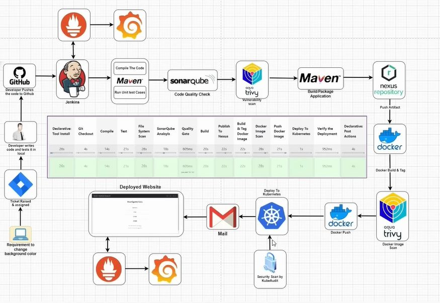

##DevSecOps Project CI/CD Pipeline

This project demonstrates a CI/CD pipeline for a Java Maven application called BoardGame. The pipeline is implemented using Jenkins and incorporates several tools and stages to ensure code quality, security, and automated deployment.
Project Map
Pipeline Overview

The Jenkins pipeline performs the following steps:

    Compile Code
        Compiles the Java code using Maven.

    Test Code
        Runs the unit tests using Maven.

    Filesystem Scan
        Scans the filesystem using Trivy and generates an HTML report.

    SonarQube Analysis
        Runs static code analysis using SonarQube.

    Quality Gate
        Waits for the SonarQube quality gate result.

    Build Code
        Packages the application using Maven.

    Push to Nexus
        Deploys the Maven artifact to Nexus.

    Build & Tag Docker Image
        Builds and tags the Docker image.

    Docker Image Scan
        Scans the Docker image using Trivy and generates an HTML report.

    Push Docker Image to Nexus
        Pushes the Docker image to Nexus.

    Change Image Version in Kubernetes
        Updates the Kubernetes deployment YAML file with the new Docker image tag.

    Deploy to EKS Cluster
        Deploys the updated application to the EKS cluster.

    Send an Email
        Sends an Email with the result of the pipeline execution.

Environment Variables

    SCANNER_HOME: Path to the SonarQube scanner.
    NEXUS_SERVER: Nexus server address.
    DOCKER_REGISTRY: Docker registry URL.
    IMAGE_TAG: Docker image tag, typically the Jenkins build number.

Tools and Technologies

    JDK
    Maven
    Jenkins: For Pipeline
    Terraform: For provisioning Kubernetes cluster
    SonarQube: For static code analysis.
    Trivy: For filesystem and Docker image scanning.
    Nexus: For artifact and Docker image storage.
    Docker: For containerizing the application.
    Kubernetes: For deploying the application.
    Helm: For deploying node-exporter of Prometheus
    Prometheus, Grafana: For Monitoring

Usage
1. Terraform

    Navigate to the terraform_eks directory and initialize Terraform
    Apply the Terraform configuration to set up the EKS Cluster

2. Set up SonarQube
3. Set up Nexus
4. Set up Jenkins

    Install the necessary tools and plugins in Jenkins.
    Configure the environment variables and credentials.

5. Run the Pipeline

    Trigger the pipeline to start the build, test, scan, and deployment process.

6. Check Reports

    Review the Trivy reports and SonarQube analysis for any issues.

7. Set up Monitoring Server

    Install Prometheus and Grafana
    Import dashboards in Grafana

8. Monitor Kubernetes Cluster with Prometheus
Install Node Exporter using Helm

    Add the Prometheus Community Helm repository:

    sh

helm repo add prometheus-community https://prometheus-community.github.io/helm-charts

Create a Kubernetes namespace for the Node Exporter:

sh

kubectl create namespace prometheus-node-exporter

Install the Node Exporter using Helm:

sh

helm install prometheus-node-exporter prometheus-community/prometheus-node-exporter --na
